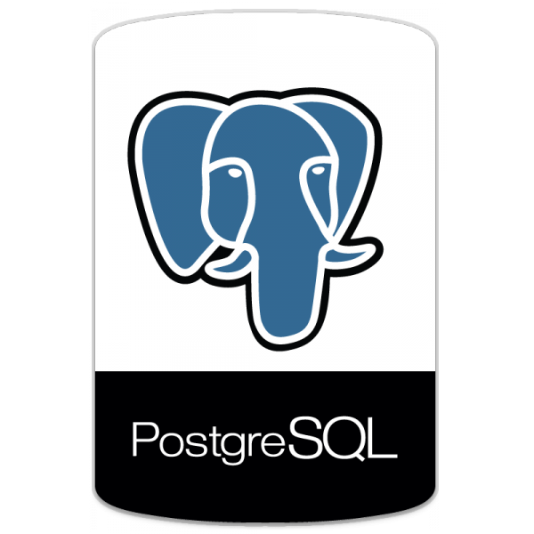

  

  :wave:  Ich bin ein angehender Data Analyst mit einer großen Neugier für Daten und alles, was man aus ihnen herausholen kann.  
    
  Mich begeistert es, Zusammenhänge zu entdecken und Dinge verständlich auf den Punkt zu bringen.  
    
  Dabei bin ich immer motiviert, Neues zu lernen und mich kontinuierlich weiterzuentwickeln.

###
##  Training Provider

<table >
  <tr>
    <td></td>
      <td style="padding-left: 11px;">
      Data Analyst 
      Smart Future Campus
      </td>
  </tr>
</table>

## Preferred Tech Stack

<h3> Backend / Data </h3>
<h2>SQL</h2>   currently learning 

  

